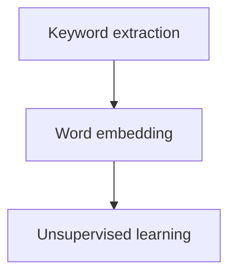
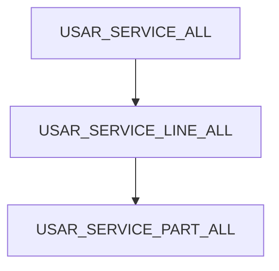

# American Statistical Association DataFest 2023
> March 31st - April 2nd, 2023

The American Statistical Association (ASA) DataFest is a celebration of data in which teams of undergraduates work around the clock to find and share meaning in a large, rich, and complex data set. The hackathon features two days of intense data wrangling, analysis, and presentation design, and each team is allowed a few minutes and no more than two slides to impress a panel of judges. Prizes are given for Best Insight, Best Visualization, and Best Use of External Data.

**2023 – American Bar Association**
 
**Goal:** Analyze data to provide advice to the American Bar Association on best to ensure the appropriate legal experts are available to support their pro bono legal advice site.
Data consisted of files pertaining to questions posed to the site.

## Best Insight Award: Espresso Overflow

Team Members:
- Jin Seok Park
- Tiantian Li
- Alexia Witthaus
- Anusha Kurapati

**Background:**

The American Bar Association (ABA) Free Legal Answers is an important part of making our justice system both equitable and accessible. By matching clients with attorneys on a pro-bono basis, low-income clients can obtain the services that their wealthier counterparts are able to afford, ultimately preventing them from legal issues that may arise. Thus, we understand that filling out accurate information and efficiently matching these clients to the right attorneys is a significant process that can help a plethora of individuals. The purpose of our approach is to examine why the category "Other" is the second most selected category despite there being 9 other legal options, and accurately depict how we can make this matching process more efficient through machine learning.​
> Note: Attorneys can sign up to receive notifications when questions are posted in their areas of interest as well as sort by subject matter and for questions that are submitted by those with senior or veteran status. Clients self-select categories. Categories and subcategories act as ‘tags’ to match cases to attorneys with relevant expertise

#

**Summary Statistics:**
- Average Attorney Matching time: 10d 21h​
- Average Time to Close Case: 8d 21h​
- ½ of the questions with legal deadline are closed past the deadline
  
| Category | Count |
|:-------|:----|
| Family & Children | 88753 |
| Other | 37053 |
| Housing & Homelessness | 34755 |
| Consumer Financial Questions | 17273 |
| Work, Employment, and Unemployment | 10187 |
| Individual Rights | 8312 |
| Health & Disability | 2707 |
| Income Maintenance | 2688|
| Education | 794 |
| Juvenile | 357 |

#

**Methodology:**
- Keyword extraction – YAKE [2]
  - Unsupervised model for identifying key phrases from documents based on statistical features extracted from text​
- Word embedding – GloVe [1]​
  - Text vectorizing methods that make it possible to represent each word by a unique numerical vector​
  - Ability to capture semantic relationships between words and phrases found in the conversations between the clients and attorneys​
  - Pre-trained on Wikipedia 2014 and Gigaword 5 (news articles before 2010)​​
- Unsupervised learning​
  - Perform unsupervised clustering: K-means clustering on the average of the word embedding vectors of the top three key phrases (3-gram), with K = 15 (15 clusters)​
  - Each cluster showcases words that fit under a certain category from the Free Legal Answers categorizing system​

#

**Results & Recommendations:**

When selecting two clusters from the 15 after K-means clustering (in this example we use clusters 1 and 6), we can see that cases within the "Other" category can actually be further specified and placed into other legal options. The category "Other" is the second most selected category among clients; thus, re-assessing current categorization methods can more effectively match the right attorneys to the right clients more efficiently, ultimately expediting the process and allowing more cases to be solved and more clients to receive much needed assistance. ​

- Semi-automate the categorization system: Category recommendation based on keywords​
- Add features for attorneys to re-classify question posts​
 

|Clusters 1 and 6|Cluster 1 and 6 Keywords|
|-|-|
|||

